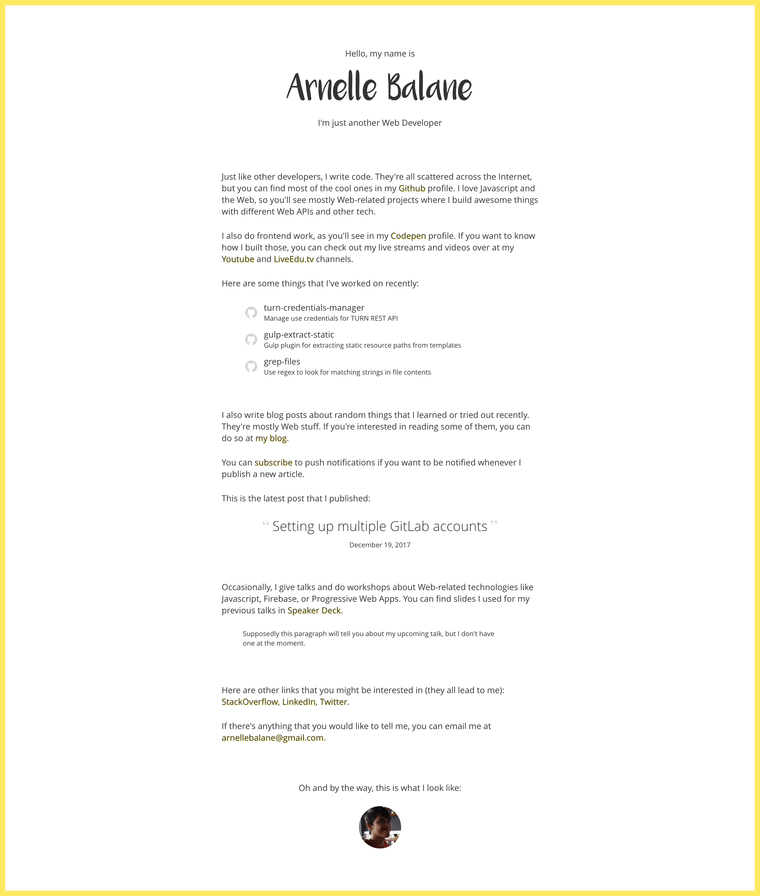

# my personal website

This is the repository for [my personal website](https://arnellebalane.com).

Aside from showing stuff about me, links to my social media accounts and to my coding projects, this website also serves as my playground where I can try new technologies and techniques, both frontend and backend, as it's really better to actually try and use these things compared to just reading about them.

## License

MIT License
