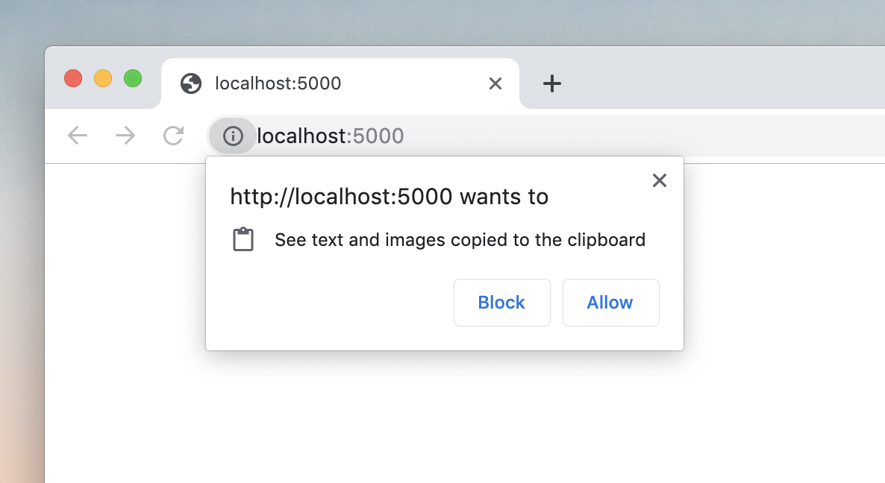

Accessing the user's clipboard has not been the nicest thing to do for a long
time. We had to use the [`document.execCommand`](https://developer.mozilla.org/en-US/docs/Web/API/Document/execCommand)
API to copy and paste text to and from the user's clipboard, which involves the
following steps:

```js
// #1. Use an input element
const input = document.querySelector('input');

// #2. Set the input's value to the text we want to copy to clipboard
input.value = 'hello there!';

// #3. Highlight the input's value
input.select();

// #4. Copy the highlighted text
document.execCommand('copy');
```

The `input` element can be dynamically created and removed during the process,
or styled to not be visible to the user. During the times that I got to use
this approach before, I always thought that it looks ugly and not very elegant.
Fortunately, a new Web API is here to make this a lot easier!


## Async Clipboard API

The [Async Clipboard API](https://developer.mozilla.org/en-US/docs/Web/API/Clipboard_API)
provides Web apps with the ability to programmatically read from and write to
the system clipboard easily. A few notes about the API:

- It can be accessed at `navigator.clipboard`
- The site needs to be served over HTTPS or localhost
- Only works when the page is the active browser tab

Now let's see how simple it actually is, compared to the old way of doing it.


### Writing to the clipboard

```js
async function writeToClipboard(text) {
    try {
        await navigator.clipboard.writeText(text);
    } catch (error) {
        console.error(error);
    }
}
```

This method returns a `Promise`, which we can wait to resolve by chaining a
`.then()` or using `async`/`await`. With that single, short line of code, we've
just written our text into the clipboard!

> **Note:** In Firefox, the text gets written to the clipboard only when calling
> `writeText()` in response to a user gesture, otherwise it throws an exception.
> Chrome writes the text to the clipboard regardless of the user gesture. Both
> allows writing to the clipboard without having to request for permission.


### Reading from the clipboard

```js
async function readFromClipboard() {
    try {
        const text = await navigator.clipboard.readText();
        console.log(text);
    } catch (error) {
        console.error(error);
    }
}
```

This method also returns a `Promise`, and is as straightforward as writing to
the clipboard. The first time a site tries to read the contents of the
clipboard, the browser prompts the user whether they want to allow the request
or not:



> **Note:** In Chrome, permission to read the clipboard is automatically denied
> when the user has dismissed it several times (~3 times from my observation).

> **Note:** At the time of writing, Firefox (version 68) doesn't support the
> `readText()` method yet, with the MDN docs stating that it is only supported
> in browser extensions.


### Checking clipboard access permissions

We can check if we have permission to access the clipboard using the
[Permissions API](https://developer.mozilla.org/en-US/docs/Web/API/Permissions):

```js
await navigator.permissions.query({name: 'clipboard-read'});
// or 'clipboard-write' for permission to write

// sample result: {state: 'granted'}
```

We can use this result for example to display some UI letting the user know
whether we have access to the clipboard or not.


## Clipboard Events

Aside from allowing us to easily write to and read from the clipboard, the
Async Clipboard API also gives us clipboard events. We can know when the user
performs a clipboard-related action such as copy, cut, or paste by listening
for the `copy`, `cut`, and `paste` events, respectively.

```js
document.addEventListener('copy', event => {});
document.addEventListener('cut', event => {});
document.addEventListener('paste', event => {});
```

These events don't fire when accessing the clipboard using the Async Clipboard
API (i.e. through `writeText()` or `readText()`), but they do when calling
their corresponding `document.execCommand` commands. Calling
`event.preventDefault()` cancels the action and maintains the current state of
the clipboard.

These events only fire when the action was performed on the page, and not when
performed in other pages or apps.

The clipboard `event` objects have a `clipboardData` property which is a
[DataTransfer](https://developer.mozilla.org/en-US/docs/Web/API/DataTransfer)
object. This allows us to overwrite the data that will be written to the
clipboard, giving us the opportunity to write data in other formats, such as
`text/html`:

```js
document.addEventListener('copy', event => {
    event.preventDefault();
    event.clipboardData.setData('text/plain', 'COPY ME!!!');
    event.clipboardData.setData('text/html', '<p>COPY ME!!!</p>');
});
```

When doing this, we need to call `event.preventDefault()` so that our custom
data is written to the clipboard instead of the original. For `cut` and `paste`
events, we need to handle removing/inserting the content in the document
ourselves.


## Image Support

So far we've only seen the version of the Async Clipboard API which only
supports reading/writing text, and it already looks cool! A recent addition to
the API is support for images, making it easy to programatically read and write
images to the clipboard!

> **Note:** For the meantime, only PNG images are supported, but support for
> other image formats (and maybe files in general) will be added in the future.


### Write an image to the clipboard

Before we can write an image to the clipboard, we first need to get a
[Blob](https://developer.mozilla.org/en-US/docs/Web/API/Blob) of the image.
There are several ways to obtain an image blob:

- Ask the user to select the image using a file input
- `fetch()` the image from the network as a blob (with `response.blob()`)
- Draw the image to a `canvas` and call `canvas.toBlob()`

Once we have an image blob (let's call it `imageBlob`), we need to create an
instance of `ClipboardItem` containing our image Blob:

```js
new ClipboardItem({
    'image/png': imageBlob
})
```

The `ClipboardItem` constructor accepts an object whose keys are the MIME types
and the values are the actual blobs themselves. We can provide multiple MIME
type and blob pairs, giving different representations of the data using
different types.

Now we can write our image to the clipboard using `navigator.clipboard.write()`:

```js
async function writeToClipboard(imageBlob) {
    try {
        await navigator.clipboard.write([
            new ClipboardItem({
                'image/png': imageBlob
            })
        ]);
    } catch (error) {
        console.error(error);
    }
}
```

`navigator.clipboard.write()` accepts an array of `ClipboardItem`s, but at the
time of writing only supports a single item. This will most likely change in
the future.


### Reading an image from the clipboard

Reading items (not just text) from the clipboard can be done using
`navigator.clipboard.read()`:

```js
async function readFromClipboard() {
    try {
        const items = await navigator.clipboard.read();
    } catch (error) {
        console.error(error);
    }
}
```

It returns an array of `ClipboardItem`s that mirrors the contents of the system
clipboard, although currently in Chrome it only returns the latest item in the
clipboard.

We can loop over this array to get each item. We can get all available MIME
types in a `ClipboardItem` through its `items` property, and get the actual
blob data for a specific type using its asynchronous `getType()` method:

```js
for (let item of items) {
    console.log(item.types); // e.g. ['image/png']

    for (let type of item.types) {
        const blob = await item.getType(type);
    }
}
```

After we get the blob, we can now do anything we want with it. We can use the
[FileReader API](https://developer.mozilla.org/en-US/docs/Web/API/FileReader)
to convert the blob to appropriate formats that we want:

```js
const reader = new FileReader();
reader.onload = () => {
    const data = reader.result;
    // e.g. 'data:image/png;base64,...'
};

reader.readAsDataURL(blob);
```

_____

The Async Clipboard API's `write()` and `read()` methods provide generic ways
for accessing the clipboard. In fact, the `writeText()` and `readText()`
methods discussed earlier are just convenience methods for them, and can
otherwise be done using `write()`/`read()` by using blobs with type
`text/plain`.

```js
async function writeToClipboard(text) {
    try {
        await navigator.clipboard.write([
            new ClipboardItem({
                'text/plain': new Blob([text], {type: 'text/plain'})
            })
        ]);
    } catch (error) {
        console.error(error);
    }
}

async function readFromClipboard() {
    try {
        const items = await navigator.clipboard.read();
        for (let item of items) {
            const data = item.getType('text/plain');
            // convert `data` to string using FileReader API's
            // `.readAsText(data)` method
        }
    } catch (error) {
        console.error(error);
    }
}
```


## Browser Support & Feature Detection

The Async Clipboard API with text support shipped in Chrome 66 and FireFox 63
(with `readText()` not yet available for Web apps). For PNG image support, only
Chrome supports it at the time of writing, shipping it in Chrome 76. See this
[browser compatibility table](https://developer.mozilla.org/en-US/docs/Web/API/Clipboard_API#Browser_compatibility)
for more info.

We can take advantage of this API already on browsers that support it by using
feature detection, by checking if `navigator.clipboard` is present.

```js
if (navigator.clipboard) {
    // Safe to use Async Clipboard API!
} else {
    // Use document.execCommand() instead
}
```


## Resources

Thanks for reading this article, I hope you enjoyed it and learned something
from it. Here are more resources to learn more about the Async Clipboard API:

- [Clipboard API and events, W3C Working Draft](https://www.w3.org/TR/clipboard-apis/)
- [Clipboard API on MDN](https://developer.mozilla.org/en-US/docs/Web/API/Clipboard_API)
- [Unblocking Clipboard Access](https://developers.google.com/web/updates/2018/03/clipboardapi)
- [Image Support for the Async Clipboard API](https://developers.google.com/web/updates/2019/07/image-support-for-async-clipboard)
